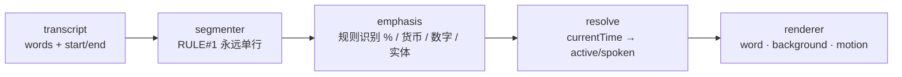

# Sera Subtitle Factory

> 给做知识/财经视频的创作者：像设计 UI 组件一样设计字幕——**永远单行、逐词跟着声音走、active 词不推挤邻词**。一份 Recipe 是一份 JSON，复制给别人就能复刻同款字幕。

**[在线试用产品](https://78tyih.github.io/sera-subtitle-factory/studio/)**（工作台直开）· **[交互展示页](https://78tyih.github.io/sera-subtitle-factory/showcase.html)**（ZH/EN × 日/夜，动效规格活演示）· [架构文档](docs/architecture.md) · [进度日志](docs/progress.md)

| 类型 | 状态 | 入口 |
|---|---|---|
| 字幕设计工具（Next.js Web App） | Phase 1 MVP（不含 Whisper / 导出 MP4）· [在线版已部署](https://78tyih.github.io/sera-subtitle-factory/) | 上表「在线试用」或下方本地运行 |

---

## 1. 解决什么问题 · Problem

视频字幕的现状是两个极端：要么锁在剪辑软件工程文件里，换个片就没了；要么是自动生成的灰色默认款，专业感为零。想要「每个词跟着声音动」的效果——卡拉OK填充、数字放大、逐词强调——只能逐帧手 K，且样式无法沉淀为可复用资产。

本工具用组件化思路解决：**字幕 = UI 组件，样式 = Recipe（JSON 配方），复用 = 复制 JSON**。

- **适合谁：** 知识/财经视频作者、需要统一字幕视觉系统的频道与团队
- **明确排除（Phase 1）：** 两行字幕 · 底部进度条 · 胶囊字幕 · 超大弹跳 · 廉价渐变 · RGB 霓虹 · 复杂纹理 · 传统剪辑软件界面 · 登录/数据库/支付

## 2. 什么场景，得到什么结果 · Scenario → Outcome

| 场景 | 做法 | 结果 |
|---|---|---|
| 知识/财经视频要专业字幕 | 选 preset → 微调 → 导出 | SRT · WebVTT · ASS · JSON 四格式 |
| 团队统一字幕视觉系统 | Recipe 库管理，导入/导出 JSON | 配方即资产，copy = replicate |
| 口播稿直接变字幕 | AI 助手写字幕（无 Key 走本地规则模式） | 文本 + 推荐样式一步到位 |

### 快速开始

```bash
npm install
npm run dev        # 开发：http://localhost:4310
npm run static     # 静态导出 + 服务器 → http://127.0.0.1:4311/studio/（推荐，零 SSR 可任意静态托管）
```

| 命令 | 作用 |
|---|---|
| `npm run dev` | 开发服务器 :4310 |
| `npm run static` | 静态导出(./out) + 静态服务器 :4311 ← **推荐** |
| `npm run export` | 只做静态导出（可直接上传任意静态托管） |
| `npm run build` / `npm start` | 动态构建 / 启动 :4310 |

**四个页面：** `/` Hero + 6 个自动循环 Demo · `/studio` 工作台（Sidebar + Preview + Inspector + Timeline）· `/library` 12 Preset（Hover 播放动效，四维过滤）· `/recipes` 配方管理（保存/复制/重命名/导入/导出）

**能力：** 字体 31 种（四分组）· 调色盘 16 色 + 取色器 + HEX · 导出 SRT/VTT/ASS/JSON · AI 助手（配任意 OpenAI 兼容接口；没配 Key 走本地规则）· 比例 16:9/4:3/1:1/9:16 · 日夜主题 + 中英双语（记忆偏好）

## 3. 什么结构 · Architecture



**三条硬规则**（写进类型与 CSS，不是口头约定）：

1. **永远单行** —— `maxLines: 1` 是类型字面量，`white-space: nowrap` 写死在 CSS。超宽不换行，**重新分段**；不可断 token 允许 ≥0.88 缩放（transform，不改字宽）。
2. **跟着声音走** —— 每个词带 `start`/`end`，状态机 `idle → active → spoken`，所有动效围绕状态设计。
3. **不推挤邻词** —— active/强调只改 `transform` + `color`，不改 layout 尺寸，整句永远不跳。

**核心概念：** `CaptionRecipe = Layout + Typography + Color + ActiveWord + Number + Emphasis + Background + Border + Motion`。动效只存名字，由 registry 解析（组件里禁止魔法数字）。

**200 个 Preset** = 12 核心（Minimal White · Minimal Black · **Editorial** · **Finance Yellow** · **Finance Blue** · Data Focus · **Left Bar** · Clean White Card · Clean Black Card · Neon Blue · Word Pop · Word Float，粗体为四个旗舰 Demo）+ 28 扩展 + 160 系统枚举。数字默认 ×1.20 / 800 字重 / 黄色。

**18 种动效：** 逐词 highlight · karaoke · pop（1.00→1.09→1.04→1.00）· bounce（Y 0→-5→1→0）· float（≤8px）· scale · glow（只给关键词）· weightShift · blurReveal · wave · none；入场 fade · float · slideUp · slideDown · scale · blurReveal · typewriter。已移除 flip 与 marquee（违背「字幕随时可读」）。

**目录：** `src/caption-engine/`（renderer·segmenter·emphasis·motions·backgrounds·borders·typography）· `src/presets/` · `src/types/caption.ts`（数据模型 + 4 个 Plugin 接口）· `src/store/`（zustand+persist，undo/redo 双栈 40 步）· `src/design-system/tokens.ts`

## 4. 能复用什么 · Value & Reuse

| 可复用部分 | 在哪 | 怎么接 |
|---|---|---|
| CaptionRecipe 数据模型（九维配方） | `src/types/caption.ts` | TS 项目直接采用 |
| 三条硬规则 | `segmenter` + `renderer` | 任何字幕/卡拉OK系统直接采用为约束 |
| 克制动效数值（pop 1.09 / bounce 5px / float 8px） | `caption-engine/motion-tokens.ts` | 数值直接抄 |
| Emphasis 规则引擎（%/货币/数字/实体） | `caption-engine/emphasis/rules.ts` | 纯正则，零 API 成本 |
| `WordTimestamp[]` + `CaptionRecipe` 两个契约 | `docs/architecture.md` | 任何 ASR 产出同结构即可接入 |

**建议从这里开始：** 打开[交互展示页](https://78tyih.github.io/sera-subtitle-factory/showcase.html)感受规则与动效 → `npm run static` 跑起工作台 → 从 12 个核心 preset 里挑一个改起。

## Phase 2 / 3（接口已预留）

- **Phase 2：** 上传视频 → 抽音频 → faster-whisper word timestamp → 接同一套 segmenter
- **Phase 3：** Remotion 渲染 + FFmpeg 导出 MP4 / SRT / ASS / WebVTT

只要 `WordTimestamp[]` 与 `CaptionRecipe` 两个契约不变，UI 层不用改。
